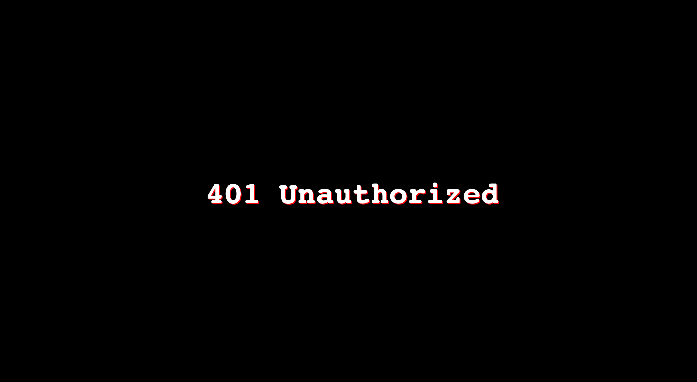

# httpcode-page

###### This is some of my customized html for http code, like `401` `403` `404` ...

Nginx:

```nginx
server {
        listen   80;
        server_name  localhost;
        charset utf-8;

        location / {
            root   html;
            random_index off;
            index  index.html index.htm;
            #if ($geoip_country_code = CN) {
            #   return 403;
            #   }
        }

        error_page  404              /404.html;
        error_page  401              /401.html;
        error_page  403              /403.html;

        # redirect server error pages to the static page /50x.html
        #
        error_page   500 502 503 504  /50x.html;
        location = /50x.html {
            root   html;
        }
      }
```

```bash
08:55:10 root@homesrv html → tree .
.
├── 401.html
├── 403.html
├── 404.html
├── 50x.html
├── img
│   └── wallhaven-Ocean.jpg
└── index.html
```

Below is some examples:

---





License @MIT
